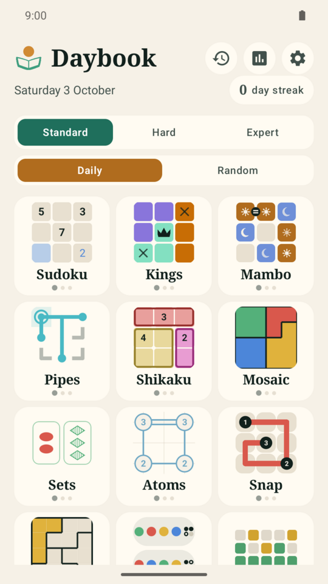
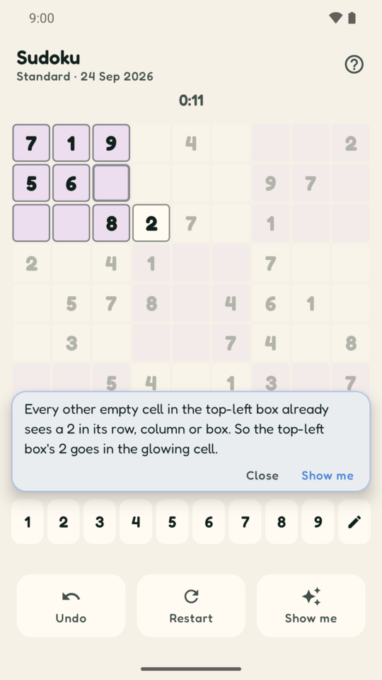
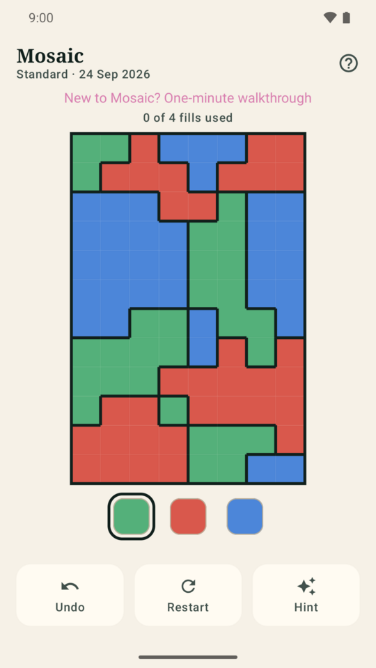
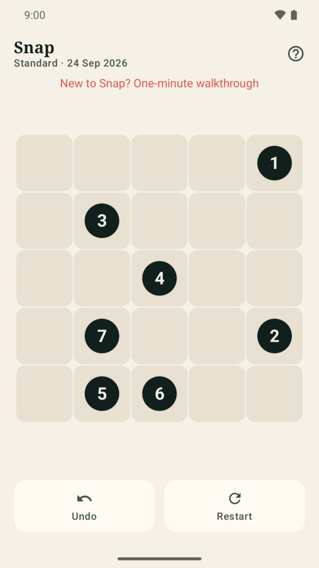

<p align="center"></p>

# Daybook

A daily logic-puzzle app for Android and the web. A new set of puzzles every day, the entire back
catalogue open from day one.

No ads. No subscription. No accounts. No network permission in the manifest at all.

| Every puzzle, every day | Sudoku | Mosaic | Snap |
|---|---|---|---|
|  |  |  |  |

## Install it

**[Download the latest release](https://github.com/joebywan/daybook/releases/latest)** and open the
`daybook-<version>.apk` on your phone.

- Take the **`.apk`**, not the `.aab`. The bundle next to it is for Google Play and Android cannot
  install it directly.
- Needs **Android 8.0 or newer** (API 26).
- Android will ask you to allow installs from whichever app you opened it with — your browser or
  file manager — the first time. That prompt is the usual one for anything not from the Play Store.
- Later releases install straight over the top, keeping your streaks and statistics, because every
  build is signed with the same key. See [Releases, CI and signing](#releases-ci-and-signing) for
  why that is checked so carefully.

Not on Google Play yet (in preparation) — see [Publishing to Google Play](#publishing-to-google-play).

## Why it works offline and for free

Every daily puzzle is *generated on the device* from its date:

```
seed = hash(date, puzzleId, difficulty)   ->   puzzle
```

The generator is a pure function of that seed and uses a hand-rolled splitmix64 PRNG rather than
`java.util.Random`, so the same date produces the same puzzle on every device and every Android
version, forever, with nothing downloaded.

That one decision is what removes the paywall. There is no archive to host, so there is no archive
to charge for — "play any past day" is just asking for a different date.

## The puzzles

Each is a classic, published puzzle genre, implemented from its rules.

| Name | Genre | What you do |
|---|---|---|
| Sudoku | Sudoku | 1–9 once per row, column and box |
| Kings | Star Battle / Queens family | One king per row, column and region, none touching |
| Mambo | Takuzu / Binairo | Two symbols, balanced lines, never three alike, `=` and `x` links |
| Pipes | Net | Rotate tiles until every pipe joins into one network |
| Shikaku | Shikaku (Nikoli) | Cut the grid into rectangles, one number each, number = area |
| Mosaic | Flood-fill (Kami family) | Recolour an area, merging it with its neighbours, until the board is one colour |
| Sets | SET | Triples that are all-alike or all-different in four traits |
| Atoms | Hashiwokakero (Bridges) | Bond atoms into one molecule, no crossings |
| Snap | Hamiltonian path | One line through every square, numbers in ascending order |
| LITS | LITS (Nikoli) | One L/I/T/S tetromino per region, no 2×2, no same letter touching |
| Tower | Mastermind | Break the hidden colour code from scored guesses |
| Lexicon | Mastermind for words | Find the hidden word; each guess marks every letter green, yellow or grey |
| Nonogram | Nonogram | Fill squares to match the run lengths beside each row and column and a picture appears |
| Inequality | Futoshiki | 1 to N once per row and column, `<` and `>` signs between some neighbours |
| Mate | Chess mate-in-N | White to play and mate in 2, 3 or 4; the opponent defends as well as it can |

Three difficulties each, which generally means a larger grid and fewer clues.

## Every board is fair

Generators do not just emit a random board and hope. Each one either constructs a solution first
and works backwards, or verifies with a solver that the clues admit **exactly one** answer:

- **Sudoku, Shikaku, Atoms** — carve or grow a board, then count solutions with a backtracking
  solver and reject anything with two.
- **Mambo** — a stricter bar: clues are stripped only while the board stays solvable by
  *propagation alone*, so it never requires a guess. Mosaic once held this bar too, before it
  turned out to be the wrong puzzle entirely.
- **Mosaic** — the move limit is the proven optimum, found by an exact search over every legal
  fill. Exhausting the search budget yields nothing and the board is reseeded; a truncated search
  must never become a shipped limit.
- **LITS and Kings** — the answer is laid down first, then regions are grown around it one square
  at a time with uniqueness rechecked at each step, because solution count only ever rises as a
  region gains squares. Regions drawn at random essentially never admit one answer. Both were
  rewritten after players hit boards the generator had never actually vetted. LITS additionally
  caps regions at seven squares, keeping the densest of 24 piece layouts per attempt, after about
  one region in six came out at eight or more.
- **Snap** — a Hamiltonian path is generated, then numbers are added until no other path obeys
  them, and then **taken back off again**: every number the rest of the board already implies is
  removed, and a board still over its clue budget is abandoned for a different seed. Stopping at
  the first forced board, which is what this used to do, left every redundant clue on the grid and
  shipped Expert boards with 39 of 42 squares numbered.
- **Pipes** — the solved board is a random spanning tree, so a fully-joined loop-free answer always
  exists.
- **Nonogram** — a random picture is kept only if a line solver finishes it: for each row or column, work out
  what every legal layout of its numbers has in common, repeat until nothing changes. A picture that needs a
  guess is thrown away, which makes the answer unique and means the hints can always point at a single line.
  An independent solver that tries every arrangement of every row confirms the one answer in the tests.
- **Inequality** — a random Latin square, every sign shown, then digits added only until the hint ladder (last
  square, only digit, only place, and the same once the signs are counted) can finish it; then every digit
  and sign the rest implies is taken back. So a board is never guessed, and the shipped board is proved
  again by an exhaustive search; an independent naive solver confirms the one answer in the tests.
- **Mate** — not generated: a position is an index into a fixed sorted list of real puzzles from the
  [Lichess puzzle database](https://database.lichess.org/#puzzles) (CC0). `tools/chess/build.py` keeps only those with
  exactly one key move and a shortest forced mate of exactly N, checked with python-chess; the tests re-prove the shipped
  lists with the app's own engine and an independent naive minimax.
- **Tower and Lexicon** — nothing hidden to prove: the code, or the word, is one random pick, and a
  guess that cannot be it is still a fair probe. Lexicon's word is an index into a fixed sorted list
  (SCOWL, screened by hand), so the browser and the app always agree; the lists are rebuilt by
  `tools/words/build.py`.

Two things make that harder than it sounds, and both have gone wrong here:

**A bounded search that gives up must say so.** A solver with a node budget that returns quietly
looks exactly like a solver that finished, so "I ran out of time" gets read as "exactly one
answer". Snap's solver returns a verdict whose give-up case is a *name*, not a number a caller can
misread, and only the proved case may ship. Mosaic reseeds rather than trusting a truncated search
for its move limit. LITS shipped the bug before either did.

**An assertion has to be able to fail.** `app/src/test/.../FallbackTest.kt` exists to catch a
generator quietly degrading to its safety fallback, which would otherwise pass every solvability
test. It has twice needed tightening after passing on boards that were plainly broken — once when
LITS fell back on every single board, and once when it asserted only that Snap numbered *fewer than
every* square while Snap was numbering 39 of 42.

Generation is not always instant: LITS takes roughly 0.1–0.5s and up to 2s on a bad seed, so boards
are generated off the main thread behind a dealing animation.

## Adding a puzzle

**Start with [`docs/PUZZLE_STANDARDS.md`](docs/PUZZLE_STANDARDS.md)**: what every puzzle must have (three
tiers, proved boards, hints that guide, an interactive walkthrough, the tests), which existing puzzle
to copy for each part, and a [step-by-step recipe](docs/PUZZLE_STANDARDS.md#13-adding-a-new-puzzle-the-recipe).

The wiring itself is two lines of code:

1. Add a file under `puzzles/` with a state class implementing `PuzzleState` and an object
   implementing `PuzzleType`.
2. Add that object to `PuzzleRegistry.all`.

Home screen, daily rotation, archive, streaks, statistics, undo, restart and the results card then
pick it up automatically. That is only the wiring, though: a finished puzzle also needs its web-parity
entries and tests, and, to match the others, hints and a walkthrough. `generate(seed, difficulty)` must
be pure, which is what keeps the archive free, and must give the same board on Android and in the
browser (see the standards doc, sections 4 and 5).

## Building

Build with **Java 17**, the JDK CI uses. Gradle 9 will run on newer ones, but nothing else is checked.

```bash
JAVA_HOME=/usr/lib/jvm/java-17-openjdk-amd64 ./gradlew assembleDebug
```

Run the generator tests (these are the ones worth keeping green):

```bash
JAVA_HOME=/usr/lib/jvm/java-17-openjdk-amd64 ./gradlew test
```

## Releases, CI and signing

Every push to `main` builds a signed release APK and publishes it as a GitHub Release.
Versions come out as `<version.txt>.<run number>` — bump `version.txt` for a meaningful
version, otherwise the run number keeps `versionCode` rising on its own.

**Signing is what makes updates install over the top.** Three things are checked before
anything is published, because each has broken an Android release before:

1. **Signed at all.** A green Gradle build proves nothing — with any signing variable missing,
   AGP quietly emits `app-release-unsigned.apk` and exits zero. `-PrequireSigning=true` turns
   that into a hard failure, and `tools/verify-apk.sh` rejects an artifact named `*unsigned*`.
2. **Signed with *the* key.** The certificate SHA-256 is committed to `android/release-key.sha256`
   and the build fails if the APK does not match it. A changed key means every installed copy has
   to be uninstalled before the next version will install.
3. **Not debuggable.** Release builds set `isDebuggable = false` explicitly and the artifact is
   checked with `aapt2`. A debuggable APK is the profile Play Protect scrutinises hardest, and
   declining its scan is what surfaces as Android's generic "App wasn't installed".

`tools/apk-cert.py` reads the certificate out of the APK's own signing block rather than shelling
out to `apksigner verify --print-certs`, which has been seen to print nothing on a CI runner and
still exit zero — turning the guard into a no-op.

CI builds `assembleRelease` too, never `assembleDebug`. Testing a different variant from the one
that ships is how a broken release goes out repeatedly behind a green check.

### Repository secrets

| Secret | What |
|---|---|
| `ANDROID_KEYSTORE_BASE64` | the keystore, `base64 -w0` |
| `ANDROID_KEYSTORE_PASSWORD` | store password |
| `ANDROID_KEY_ALIAS` | `daybook` |
| `ANDROID_KEY_PASSWORD` | key password (same as the store password) |
| `RENOVATE_TOKEN` | *optional* PAT — see below |

GitHub secrets are write-only. The keystore and its password live outside the repo at
`~/Documents/github/Claude/daybook-android-signing/` (0700, files 0600) and that is the only
readable copy. Losing it means every installed copy must be uninstalled to update.

## F-Droid

Add `https://knowhowit.com.au/daybook/fdroid/repo` as a repository in the F-Droid app (certificate fingerprint:
`android/release-key.sha256`). Every release is added to it automatically, signed with the same key as the APK on
the Releases page, so it updates in place. How it works, and why f-droid.org itself is not there yet:
[`docs/fdroid/README.md`](docs/fdroid/README.md).

## Publishing to Google Play

Every release already builds and attaches a signed `.aab` alongside the `.apk`. Once Play is set
up, `.github/workflows/publish-play.yml` uploads that bundle to the **closed testing** track (`alpha`; the owner does not use internal testing).
Until the `PLAY_SERVICE_ACCOUNT_JSON` secret exists the workflow logs a notice and does nothing, so
it is safe sitting here unconfigured.

`release.yml` calls it directly as a reusable workflow rather than letting it wait on the
`release: published` event, because a release created with `GITHUB_TOKEN` does not trigger other
workflows — the same quirk that stops CI running on Renovate's pull requests.

### Get the signing decision right first

Play App Signing is mandatory for new apps: Google holds the key that signs what users actually
download, and you sign uploads with an *upload key*. When you create the app you choose where
Google's copy comes from, and the choice is effectively permanent:

- **Upload the existing `daybook-release.jks` as the app signing key** (Play Console offers
  "export and upload a key from a Java keystore", using Google's PEPK tool). Play-delivered builds
  then carry the same certificate as the sideloaded ones, so a sideloaded install upgrades to a
  Play install in place. **This is the one to pick** given in-place updates are the whole point of
  the signing setup here.
- **Let Google generate a fresh app signing key.** Simpler, but Play builds then have a different
  certificate from the sideloaded APKs, so any device already carrying a sideloaded Daybook has to
  uninstall — losing its streaks and statistics — before it can install from Play.

### The steps only a human can do

1. **Play Console → Create app.** Done 2026-10-02: "Daybook: Daily Logic Puzzles", `com.joebywan.daybook`, en-AU, Game (Puzzle), free. The listing, content rating, target audience (13+), data safety and every other App content declaration are filled in too; what is left is steps 2 and 4-7.
2. **Set up app signing** and upload `~/Documents/github/Claude/daybook-android-signing/daybook-release.jks`
   as the app signing key, per the choice above. Alias `daybook`; the store and key passwords are
   the same string, in `keystore-password.txt` (no trailing newline).
3. **Fill in the declarations:** privacy policy URL, data safety, content rating, target audience,
   ads (none). [`PRIVACY.md`](PRIVACY.md) is written for this — its rendered GitHub URL works as
   the policy link, and the data safety answers are all "no data collected", which is true: the app
   declares no `INTERNET` permission.
4. **Upload one bundle by hand** to the closed testing track (done 2026-10-02). Play will not accept API uploads for an app
   that has never had a release created in the console.
5. **Make a service account:** Google Cloud Console → IAM → Service Accounts → create → create a
   JSON key. Then Play Console → Users and permissions → invite that service account's email →
   grant *View app information* and *Release to testing tracks*.
6. **Add the JSON** as the `PLAY_SERVICE_ACCOUNT_JSON` repository secret.

7. **Production needs a closed test first** (personal developer accounts created after 13 Nov 2023
   only): create a closed-testing track, get at least 12 testers opted in, keep them opted in for 14
   continuous days (dropping below 12 restarts the clock), then apply for production access in the
   Console's Dashboard. Testers join by a link or a Google Group, and need a Google account. Upload a
   release to the closed track by `workflow_dispatch` on the publish workflow with `track: alpha`
   (the Console's "closed testing" track is `alpha` to the API unless a custom track is made).

Listing text, graphics and every declaration's answer are prepared in
[`docs/play/LISTING.md`](docs/play/LISTING.md).

From then on it is automatic. `workflow_dispatch` on that workflow also lets you push an existing
release to `alpha`, `beta` or `production` by hand.

### A note on the bundle check

`tools/verify-aab.sh` fails an unsigned bundle but does **not** pin its fingerprint, unlike the APK
check. With Play App Signing the bundle carries the upload key, which is allowed to differ from the
app signing key and may be rotated. Worth knowing: an unsigned bundle is still called
`app-release.aab`, with no `-unsigned` in the name to give it away, which is why that check looks
inside for a signature block rather than trusting the filename.

## Dependency updates

Renovate runs daily from `.github/workflows/renovate.yml`, self-hosted so it needs no GitHub App
installed. It only *opens* PRs inside `renovate.json`'s `schedule` (before 9am on Monday, Sydney),
so the other six runs a week just merge what is ready. GitHub Actions bumps and patch bumps
automerge; minor and major open a PR to look at.

`main` requires a PR and a passing `build` check, but pull requests made with the default
`GITHUB_TOKEN` do not trigger other workflows, so CI would never start on Renovate's. The workflow
gets round it without a token or app: after Renovate runs, `tools/dispatch-ci-for-renovate.sh`
finds each open `renovate/*` PR whose head commit has no `build` yet and dispatches `ci.yml` on
its branch (`workflow_dispatch` is exempt from that rule). A dispatched run's own check run is not
counted by the PR, so `ci.yml` also posts a commit status named `build` on the commit when it was
dispatched, which is what satisfies the ruleset. A rebased branch has a new commit, so it is
built again; a PR already built is left alone; a failed build is not re-run.

Renovate merges a PR on a later run once `build` is green (daily), or at once if the repository's
"Allow auto-merge" setting is on, since `platformAutomerge` then hands the merge to GitHub. Minor
and major PRs get the same build but are merged by hand. A `RENOVATE_TOKEN` PAT (or the Renovate
App) remains an optional alternative: PRs then trigger CI themselves and the script finds nothing
to do.

## Licence

AGPL-3.0-or-later; see [`LICENSE`](LICENSE). The word lists carry their own notice, [`docs/word-lists/LICENSE-SCOWL.txt`](docs/word-lists/LICENSE-SCOWL.txt), and the Fredoka typeface its own, [`docs/fonts/LICENSE-FREDOKA-OFL.txt`](docs/fonts/LICENSE-FREDOKA-OFL.txt).

## Not done yet

The maintained list is [`docs/TODO.md`](docs/TODO.md); the headlines:

- No accessibility work: the eight boards drawn with raw pointer input expose no click actions, so
  a screen reader cannot operate them
- Play Store listing not yet created — see "Publishing to Google Play" above
